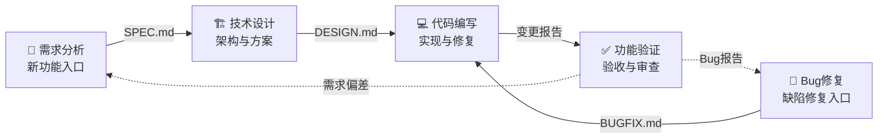

<p align="center">
  
</p>

<h1 align="center">Vibe Coding Init</h1>
<p align="center"><strong>一键初始化多角色协作项目</strong></p>

<p align="center">
  
  
  
  
</p>

---

## 这是什么？

**Vibe Coding Init** 是一个 ZCode Skill，用于一键初始化 vibe coding 项目的协作结构。

它会自动完成：
- ✅ 初始化 Git 仓库
- ✅ 创建 `.vibe/` 协作目录
- ✅ 生成角色分配文件（`.vibe/ROLES.md`）
- ✅ 搭建跨会话消息总线（`.vibe/HANDOFF.md`）
- ✅ **自动创建 5 个 ZCode 角色会话**并在 GUI 中可见

---

## 五角色协作体系



| # | 角色 | 图标 | 职责 | 产出文件 |
|---|------|------|------|----------|
| 1 | 需求分析 | `🎯` | 分析需求、拆解任务（新功能入口） | `.vibe/SPEC.md` |
| 2 | Bug修复 | `🐛` | 分析缺陷根因、编写修复方案（缺陷入口）| `.vibe/BUGFIX.md` |
| 3 | 技术设计 | `🏗️` | 架构方案、数据模型、接口契约 | `.vibe/DESIGN.md` |
| 4 | 代码编写 | `💻` | 根据方案编写/修复代码 | 项目源码 |
| 5 | 功能验证 | `✅` | 验收功能、审查质量、发现缺陷 | 验证报告 |

---

## 快速开始

### 安装

```bash
# 安装到用户级 skills（所有项目可用）
cp SKILL.md ~/.agents/skills/vibe-coding-init/

# 或在 ZCode 中输入
/技能创建者 加载 vibe-coding-init
```

### 使用

在 ZCode 项目目录中输入：

```
初始化 vibe coding 项目
```

或者显式调用：

```
/vibe-coding-init
```

Skill 会自动检测环境并开始初始化。

### 自动创建会话（需要 Node ≥ 22）

```bash
# 确保 Node 22+
brew install node@22
export PATH="/usr/local/opt/node@22/bin:$PATH"

# Skill 会自动执行以下等价命令：
ZCODE="/Applications/ZCode.app/Contents/Resources/glm/zcode.cjs"

node "$ZCODE" --prompt "你是「项目名」的需求分析角色…" --cwd "$(pwd)" --mode yolo
node "$ZCODE" --prompt "你是「项目名」的 Bug修复角色…" --cwd "$(pwd)" --mode yolo
# ... 共 5 个会话
```

创建完成后，会话自动注册到 ZCode GUI 任务列表，标题显示为角色名。

---

## 跨会话协作机制

### 消息总线 (HANDOFF.md)

所有角色通过 `.vibe/HANDOFF.md` 传递消息：

```markdown
| 时间 | 发送方 | 接收方 | 消息 |
|------|--------|--------|------|
| 10:00 | 🎯 需求分析 | 🏗️ 技术设计 | SPEC.md 已完成，请接手设计 |
| 10:15 | 🏗️ 技术设计 | 💻 代码编写 | DESIGN.md 已完成，请开始编码 |
| 10:30 | 💻 代码编写 | ✅ 功能验证 | 实现完成，文件：index.html, app.js |
| 10:35 | ✅ 功能验证 | 🐛 Bug修复 | 发现 Bug：计时器暂停后无法恢复 |
```

### 会话上下文读取

任意角色可通过 `ReadSessionContext` 拉取其他角色的完整讨论：

```
ReadSessionContext(sessionId="上游会话ID", query="关于 SPEC.md 的设计决策")
```

---

## 双入口工作流

### 新功能流（需求驱动）

```
需求分析 → 技术设计 → 代码编写 → 功能验证 → ✅ 完成
```

### 缺陷修复流（Bug 驱动）

```
功能验证 → Bug修复 → [技术设计?] → 代码编写 → 功能验证 → ✅ 关闭
```

复杂 Bug 涉及架构变更时，Bug修复会先经过技术设计。

---

## Superpowers 集成

每个角色在职责范围内自动使用对应的 ZCode Superpower：

| Superpower | 需求分析 | Bug修复 | 技术设计 | 代码编写 | 功能验证 |
|---|---|---|---|---|---|
| `brainstorming` | ✅ | ✅ | ✅ | — | — |
| `writing-plans` | ✅ | ✅ | ✅ | — | — |
| `systematic-debugging` | — | ✅ | — | ✅ | ✅ |
| `test-driven-development` | — | — | — | ✅ | — |
| `subagent-driven-development` | — | — | — | ✅ | — |
| `verification-before-completion` | — | ✅ | — | ✅ | ✅ |

---

## 项目结构

初始化后：

```
my-project/
├── .vibe/
│   ├── ROLES.md          # 角色分配表 + 协作规则
│   ├── HANDOFF.md        # 跨会话消息总线
│   ├── SPEC.md           # 需求分析产出
│   ├── DESIGN.md         # 技术设计产出
│   └── BUGFIX.md         # Bug修复产出
├── .git/                 # Git 仓库
└── (你的代码)
```

---

## 环境要求

| 依赖 | 版本 | 用途 |
|------|------|------|
| ZCode | ≥ 3.1 | Skill 运行环境 |
| Node.js | ≥ 22 | 自动创建会话（Path A） |
| macOS / Linux | — | 兼容 `zcode` CLI |

如果 Node < 22，Skill 会自动走 **Path B（手动创建）**，提供完整的手动操作指南。

---

## 许可证

MIT © 2024

---

<p align="center">
  <sub>Made for the vibe coding workflow</sub>
</p>
