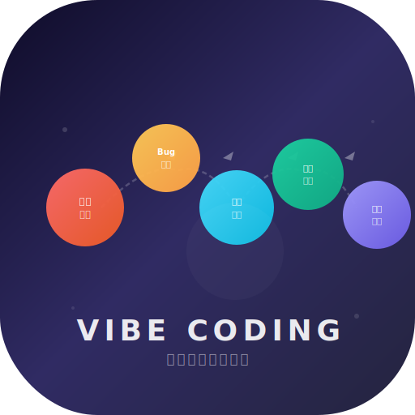
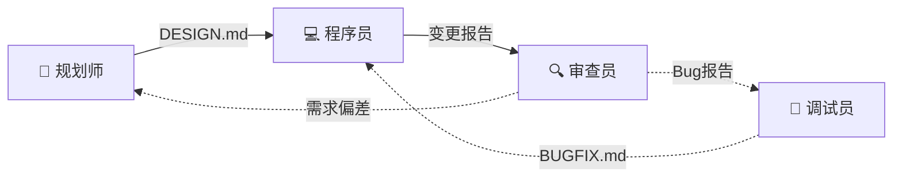

<p align="center">
  
</p>

<h1 align="center">Vibe Coding Init</h1>
<p align="center"><strong>一键初始化多角色自动协作项目</strong></p>

<p align="center">
  <a href="https://witstudio86.github.io/vibe-coding-init/"></a>
  
  
  
  
</p>

> 🌐 **在线介绍页**：[witstudio86.github.io/vibe-coding-init](https://witstudio86.github.io/vibe-coding-init/)

---

## 这是什么？

一键初始化多角色协作项目：

- ✅ Git 仓库初始化
- ✅ 创建 `.vibe/` 协作目录（ROLES.md + HANDOFF.md）
- ✅ **秒级创建 4 个 ZCode 角色会话**（直接写数据库，无需 API）
- ✅ GUI 中标题为角色名（不被首条消息覆盖）
- ✅ `/trigger` 自定义命令——一行触发下游会话

---

## 四角色体系

| 角色 | 职责 | 产出 | 边界 |
|------|------|------|------|
| 📐 规划师 | 需求分析 + 技术设计 | SPEC.md + DESIGN.md | 不写代码 |
| 💻 程序员 | TDD 编码实现 | 项目源码 | 不设计、不验收 |
| 🔍 审查员 | 功能验收 + 代码审查 | REVIEW.md | 不修改代码 |
| 🐛 调试员 | Bug 根因分析 | BUGFIX.md | **一行代码都不改** |



---

## 快速开始

```bash
# 安装 skill
cp SKILL.md ~/.agents/skills/vibe-coding-init/

# 安装 /trigger 命令
mkdir -p ~/.zcode/commands
cp scripts/trigger.md ~/.zcode/commands/
```

在 ZCode 中：

```
初始化 vibe coding 项目
```

---

## 自动协作

```
规划师 完成 → /trigger 程序员 → /trigger 审查员
                                      │
                          Bug ──→ /trigger 调试员 → /trigger 程序员
                          偏差 ──→ /trigger 规划师
```

**核心特性**：
- **秒级创建**：直接写 SQLite，4 个会话 < 0.2 秒
- **`/trigger` 命令**：一行触发下游，无需拼 Bash
- **GUI 可见**：标题为角色名（`title_overridden=1`）
- **消息总线**：`.vibe/HANDOFF.md` 记录跨会话通信
- **角色隔离**：每个角色有明确 ✅/❌ 边界

---

## 项目结构

```
├── .vibe/
│   ├── ROLES.md      # 角色分配 + 规则
│   ├── HANDOFF.md    # 消息总线
│   ├── SPEC.md       # 规划师产出
│   ├── DESIGN.md     # 规划师产出
│   ├── REVIEW.md     # 审查员产出
│   └── BUGFIX.md     # 调试员产出
├── .git/
└── (你的代码)
```

## 许可

MIT © 2024
